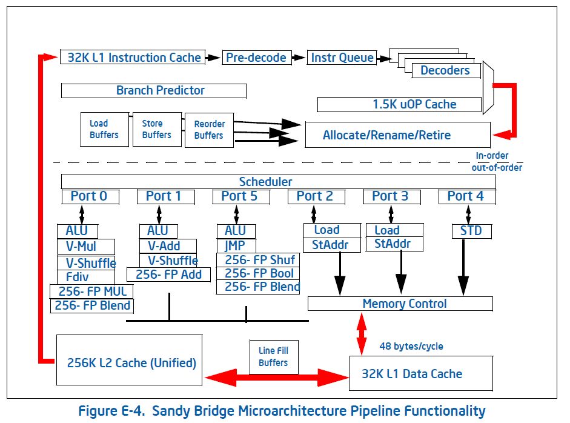
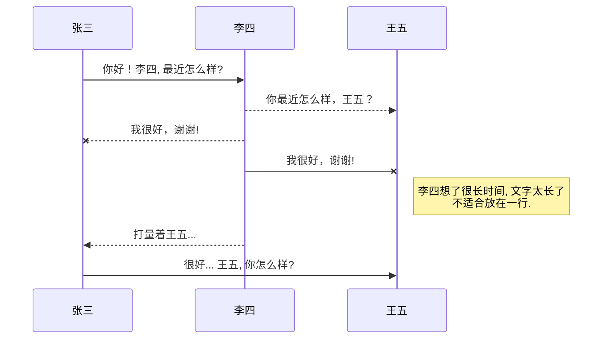
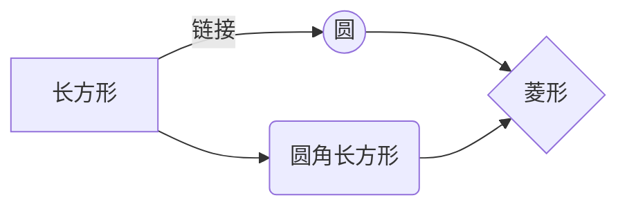

# 【Intel 软件优化手册】E2 Sandy Bridge 微架构（包含宏融合与微融合的描述）

@[TOC](目录)

# E.2 Sandy Bridge 微架构

Sandy Bridge 微架构构建在 Intel Core 微架构和 Nehalem 微架构之后的基础上。它提供了以下革命性的特征：

- Intel Advanced Vector Extensions (Intel AVX)
-- 256位浮点指令集，对128位 Intel Streaming SIMD 扩展，相比于128位代码，提供了高达2倍的性能增益。
-- 非销毁性的目的操作数编码提供了更灵活的代码编写技术。比如：

```nasm
vpaddd    xmm0, xmm1, xmm2

; 相比于之前的：
paddd     xmm1, xmm2
```

-- 支持灵活的移植以及在 256位 AVX 代码、128位 AVX 代码 以及遗留的 128位 SSE  代码协同存在。

- 增强的前端以及执行引擎
-- 新的被译码的 ICache（Decoded ICache） 组件提升了前端带宽并从而减少了分支预测失败处罚。
-- 高级分支预测。
-- 额外的宏融合（macro-fusion）支持。
-- 更大的动态执行窗口。
-- 多精度整数算术增强（ADC/SBB，MUL/IMUL）。
-- LEA 带宽增强。
-- 对通用执行拖延的减少（读端口，写回冲突，旁通延迟，部分拖延）。
-- 快速浮点异常处理。
-- XSAVE/XSTORE 性能提升以及新增 XSAVEOPT 指令。

- 对于更宽数据路径的 Cache 层级提升
-- 通过两个对存储器操作的对称端口来允许两倍的带宽。
-- 通过增加缓存可允许同时处理更多的活跃（in-flight）加载与存储。
-- 每个周期具有两个加载及一个存储的内部带宽。
-- 提升预取。
-- 高带宽低延迟 LLC（Last Level Cache）架构。
-- 高带宽的 die 上互联的环形架构。

- SoC（System-on-a-chip）支持
-- 在第二代 Intel Core 处理器中集成了图形和多媒体引擎。
-- 集成了 PCIe 控制器。
-- 集成了存储器控制器。

- 次时代的 Intel Turbo Boost 技术
-- 利用 TDP 余量（headroom）增强 CPU 核心与集成图形单元的性能。

<br />

## E.2.1 Sandy Bridge 微架构流水线概述

图 E-4 描述了基于 Sandy Bridge 微架构的一个处理器核心的主要组件以及流水线。该流水线由以下部分组成：

- 一个按次序发射的前端。它取指令，并将这些指令译码为微操作（micro-operations）。前端用一条连续不断的微操作流喂给流水线下一个阶段，这些微操作流从程序将会执行的最有可能的路径来获取。
- 一个乱序的、超标量执行引擎每周期分派多达6个微操作进行执行。分配/重命名块将微操作重排序为“数据流”次序，这样它们可以在其源操作数准备就绪并且其执行资源已经可用之后立即执行。
- 一个按次序的隐退（retirement）单元，确保了微操作的执行结果，包括它们可能遭遇的任何异常，根据原始的程序次序可见。

流水线中的一条指令的流（flow）可以用以下流程来概述：

1. 分支预测单元（Branch Prediction Unit）从程序选择了下一个要执行的代码块。处理器在以下资源中搜索代码，按此次序：

a. 被译码的 ICache。
b. 指令 Cache，通过激活遗留译码流水线。
c. L2、最终层 Cache（LLC）以及存储器，按照需要。



2. 对应于此代码的微操作被发送到重命名/隐退块。它们以程序次序进入调度器，但根据数据流次序从调度器执行并被释放。对于同时就绪的微操作，几乎总是维护着 FIFO 次序。
使用被安排在三个栈中的执行资源而来执行微操作。每个栈中的执行单元关联于该指令的数据类型。
分支预测失败在分支执行时发出信号。它重新掌舵前端，从正确的路径传递微操作。处理器可以用后续正确路径的作业来叠交（overlap）分支预测失败之前的作业。
3. 存储器操作受到管理，并且被重排序，以达成并行度以及最大性能。对 L1 数据 Cache 的命中失败将会去往 L2 Cache。数据 Cache 是非阻塞的并且可以处理多个同时发生的命中失败。
4. 异常（错误，陷阱）在错误指令的隐退（或企图隐退）时发出信号。

基于 Sandy Bridge 微架构的每个处理器核心可以支持两个逻辑处理器，如果开启了 Intel Hyper-Threading（超线程）技术。

<br />

## E.2.2 前端

这一章节描述了前端的关键特性。表 E-8 列出了前端的组件、它们的功能、以及它们所要处理的问题。

表 E-8：Sandy Bridge 微架构前端的组件

组件 | 功能 | 性能挑战
---- | ---- | ----
指令 Cache | 32KB 指令字节的后备存储 | 对热点（hot）代码指令字节的快速访问
遗留的译码流水线 | 将指令译码为微操作，传递给微操作队列以及被译码的 ICache（Decoded ICache）。 | 提供了与先前 Intel 处理器同样的译码延迟和带宽。 <br/> Decoded ICache 预热
Decoded ICache | 将微操作流提供给微操作队列 | 比起遗留的译码流水线，以更低的延迟以及更低的电能提供了更高的微操作带宽。
MSROM | 复杂指令微操作流存储，既可以从遗留的译码流水线也可以从 Decoded ICache 访问。 | 
分支预测单元（BPU） | 确定要被执行的下一个代码块，并驱动对 Decoded ICache 和遗留译码流水线的查找（lookup）。 | 通过减少的分支预测失败来提升性能以及能效。
微操作队列 | 将微操作从 Decoded ICache 和遗留的译码流水线进行排队。 | 隐藏前端气泡；以一个常量周期率（rate）提供执行微操作。

<br />

### E2.2.1 遗留的译码流水线

遗留的译码流水线由 ITLB（instruction translation lookaside buffer）、指令 Cache（ICache）、指令预译码（instruction predecode），以及指令译码单元组成。

<br />

**指令 Cache 与 ITLB**

一条取指令是一次16字节对齐的通过对 ITLB 的查找，并加载进指令 Cache。指令 Cache 可以每周期传递16字节给指令预译码器。表 E-8 跟前一代处理器微架构比较了 ICache 和 ITLB。

Table E-9. 基于 Sandy Bridge 微架构的 ICache 和 ITLB

组件 | Sandy Bridge 微架构 | Nehalem 微架构
---- | ---- | ----
ICache 大小 | 32KB | 32KB
ICache 路数 | 8路 | 4路
ITLB 4KB 页条目个数  | 128 | 128
ITLB 大页（2MB 或 4MB）条目个数 |  8 | 7

如果发生 ITLB 命中失败，将会有对二级 TLB（Second Level TLB -- STLB）的查找，这对于 DTLB 和 ITLB 都是共用的。一次 ITLB 的命中失败但一次 STLB 命中的性能处罚是7个周期。

<br />

**指令预译码**

预译码单元从指令 Cache 接受16字节，并判定指令的长度。

带有会改变长度的前缀（Length Changing Prefixes -- LCPs）意味着指令长度与默认的指令长度不同。从而，它们在长度译码期间会引发一次额外的每个 LCP 的三周期的处罚。先前的处理器对于每16个字节的块（chunk）会遭到一次六周期的处罚，该16字节的 chunk 在其中具有一个或多个 LCP。由于通常在一个16字节 chunk 中不会有多于一个 LCP，因此在大部分情况下，Sandy Bridge 微架构对于先前的处理器引入了一种提升。

- 操作数大小覆盖（Operand Size Override）（66H）将一个 word 立即数数据放置在一条指令之前。这个前缀可以当代码使用16位数据类型、Unicode 处理、以及图像处理时出现。
- 地址大小覆盖（Address Size Override）（67H）在实模式、大实模式、16位保护模式、32位保护模式下，将一个 modr/m 放置在一条指令之前。这个前缀可以出现在引导代码序列之中。
- 在 Intel64 指令集中的 REX 前缀（4xh）可以改变两类指令的大小：MOV 偏移和 MOV 立即数。尽管有此能力，不过它并不会导致一次 LCP 处罚，并因而不被认为是一个 LCP。

<br />

**指令译码**

有四个译码单元将指令译码为微操作。第一个译码单元可以将所有 IA-32 以及 Intel64 指令译码为多达四个微操作大小。剩下的三个译码单元处理单个微操作指令。所有四个译码单元支持单个微操作流的通常情况，包括微融合与宏融合。

由译码器发射的微操作被转发到微操作队列以及 Decoded ICache。长于四个微操作的指令从 MSROM 生成它们的微操作。MSROM 带宽为每周期四个微操作。其微操作来自 MSROM 的指令可以要么从遗留的译码流水线开始，也可以从 Decoded ICache 开始。

<br />

**微融合（Micro-Fusion）**

微融合从同一条指令将将多个微操作融合为一单个复杂微操作。该复杂微操作在乱序引擎核心中被分派就如同它非微融合的同样多次。

微融合允许你使用存储器到寄存器操作，也被称作为复杂指令集计算机（CISC）指令集，以表达实际程序操作而不用担心译码带宽的损失。微融合提升了从译码到隐退所传递的指令带宽，并节省了能耗。

通过使用单个微操作的指令来编程一条指令序列将会增加代码尺寸，而这将会从遗留的流水线减少取指带宽。比如：

```nasm
add    eax, dword ptr [rdi + rsi * 4 + 16]

; 改写为多条更简单的指令
mov    rdx, rsi
shl    rdx, 2
add    rdx, rdi
add    rdx, 16
mov    ecx, dword ptr [rdx]
add    eax, ecx
```

以下为可以被所有译码器处理的微融合的微操作的例子。

- 所有存储到存储器，包括存储立即数。存储执行在内部作为两个独立的功能：地址存储和数据存储。
- 将加载和计算操作结合在一起的所有指令（load+op），比如：

```nasm
ADDPS    XMM9, OWRD PTR [RSP + 40]
FADD     DOUBLE PTR [RDI + RSI * 8]
XOR      RAX, QWORD PTR [RBP + 32]
```

- 所有形式为“加载并跳转”的指令，比如：

```nasm
JMP    [RDI + 200]
RET
```

- 带有立即数操作数和存储器操作的 CMP 和 TEST

带有 RIP 相对寻址的一条指令在以下情况下不会被微融合：

- 需要一个额外的立即数，比如：

```nasm
CMP    [RIP + 400], 27
MOV    [RIP + 3000], 142
```

- 当前指令是带有一个通过使用 RIP 相对寻址所指定的间接目标的控制流指令，比如：

```nasm
JMP    [RIP + 5000000]
```

在这些情况下，不能被微融合的一条指令将要求译码器0发射两个微操作，从而导致译码带宽的一些损失。

在64位代码中，对 RIP 相对寻址的使用对于全局数据是很常见的。由于在这些情况下没有微融合，当将32位代码移植到64位代码时，性能可能会有所降低。

<br />

**宏融合（Macro-Fusion）**

宏融合将两条指令融合为一单个微操作。在 Intel Core 微架构中，此硬件优化受限于特定的条件，这些条件特定于可宏融合的指令对的第一条和第二条指令。

- 被宏融合对的第一条指令修改标志。以下指令可以被宏融合：<br/> -- 在 Nehalem 微架构中：CMP，TEST。 <br/> -- 在 Sandy Bridge 微架构中：CMP，TEST，ADD，SUB，AND，INC，DEC。<br/> -- 这些指令可以融合，如果：  
  - 第一个源/目的操作数是一个寄存器。
  - 第二个源操作数（如果存在）是这些其中之一：立即数、寄存器、或非 RIP 相对寻址访存。
- 可融合对的第二条指令是一个带条件分支。 表3-1描述了对于每条指令，它可以与什么分支融合。

表3-1：在 Sandy Bridge 微架构中的宏融合指令

指令 | TEST  | AND | CMP | ADD | SUB | INC | DEC
---- | ---- | ---- | ---- | ---- | ---- | ---- | ----
JO/JNO | Y | Y | N | N | N | N | N
JC/JB/JAE/JNB | Y | Y | Y | Y | Y | Y | N | N
JE/JZ/JNE/JNZ | Y | Y | Y | Y | Y | Y | Y
JNA/JBE/JA/JNBE | Y | Y | Y | Y | Y | N | N
JS/JNS/JP/JPE/JNP/JPO | Y | Y | N | N | N | N | N
JL/JNGE/JNL/JLE/JNG/JG/JNLE | Y | Y | Y | Y | Y | Y | Y

如果第一条指令结束于一条 Cache 行的第63个字节上，并且第二条指令是起始于下一条 Cache 行的第0个字节的一条带条件分支指令，那么宏融合不会发生。

由于这些指令对在许多类型的应用程序中很是常见，因而宏融合即便在没有被重新编译的二进制程序上也能有性能提升。

每条受到宏融合的指令以一单次分派执行。这减少了延迟并释放了执行资源。这也提升了寄存器重命名以及指令隐退带宽，增加了虚拟存储，并且通过使用更少的比特来表示更多的作业以节省能耗。

<br />

### E.2.2.2 Decoded ICache

Decoded ICache 本质上是遗留译码流水线的一个加速器。通过存储被译码的指令，Decoded ICache 允许以下特征：

- 在分支预测失败上减少延迟。
- 增加的微操作将带宽传递给乱序引擎。
- 减少前端能耗。

Decoded ICache 快速缓存指令译码器的输出。在下一次这些微操作为执行而被消耗时，被译码的微操作从 Decoded ICache 被取出。这允许为这些微操作跳过取指令和译码阶段，并从而减少能耗及前端的延迟。Decoded ICache 提供了平均对微操作 80% 以上的命中率；此外，“热点（hot spots）”一般具有接近100%的命中率。

一般的整数程序每条指令平均少于4个字节，而前端可以在后端之前快速移动，为调度器将指令填充进一个大的窗口中，以找到指令集并行（instruction level parallelism）。然而，对于带有一个由许多指令所构成的基本块的高性能代码，比如，Intel SSE 多媒体算法，或是相当巨大的循环展开，每周期16个指令字节偶尔会是一个限制。因而，Decoded ICache 的32字节的定向帮助这类代码避免该限制。

Decoded ICache 由32组（Cache 组相联）组成。每组包含了8路。每路可以持有多达6个微操作。Decoded ICache 在理想情况下可以持有多达1536个微操作。

以下为 Decoded ICache 如何用微操作进行填装的一些规则：

- 在某一路（Way）上的所有微操作表示代码中静态连续的指令，并且使它们的 EIP 在同一32字节对齐的区域之内。
- 可以多达三路专用于同一32字节对齐的 chunk，原始 IA（Intel 架构）程序的每32字节的区域可允许总共有18个微操作被快速缓存。
- 一条具有多个微操作的指令不能被跨路分割。
- 每路可允许多达两条分支指令。
- 开启 MSROM 的一条指令消费一整条路。
- 一个非条件的分支是一条路中的最后一个微操作。
- 被微融合的微操作（load + op 以及存储）被保持为一个微操作。
- 一对被宏融合的指令被保持为一个微操作。
- 带有64位立即数的指令要求有两个槽（slots）来存放立即数。

当微操作由于上述这些限制而无法被存放进 Decoded ICache 时，它们从遗留的译码流水线被传递。一旦微操作从遗留的译码流水线被传递，从 Decoded ICache 取微操作只能在下一个分支微操作之后恢复。频繁的切换会导致性能处罚。

Decoded ICache 实际上包含在了指令 Cache 和 ITLB。也就是说，Decoded ICache 中任一带有微操作的指令具有其原始的指令字节存在于指令 Cache。指令 Cache 的指令逐出必须也要从 Decoded ICache 逐出，而这仅仅逐出必要的 cache lines。

有一些情况使得整个 Decoded ICache 要被冲刷。其中一个理由可能是一个 ITLB 条目的逐出。其他理由通常对于应用程序的程序员不可见，由于它们是当重要的控制被改变时发生，比如，在 CR3 中的映射，或是在 CR0 和 CR4 中开启的特征和模式。也有一些情况使得 Decoded ICache 被禁用，比如，当 CS 基地址 **没有被** 设置为 **零** 的时候。

<br />

### E2.2.3 分支预测

分支预测，预测分支目标并允许处理器在分支为真的执行路径已知之前便开始执行指令。所有分支利用分支预测单元（BPU）进行预测。此单元不仅基于分支的 EIP，而且也基于通过哪个执行可达到此 EIP 的执行路径来预测目标地址。BPU 可以高效地预测以下分支类型：

- 带条件分支。
- 直接调用和跳转。
- 间接调用和跳转。
- 调用返回。

<br />

### E.2.2.4 微操作队列及循环流预测器（LSD）


<br />

## 新的改变

我们对Markdown编辑器进行了一些功能拓展与语法支持，除了标准的Markdown编辑器功能，我们增加了如下几点新功能，帮助你用它写博客：
 1. **全新的界面设计** ，将会带来全新的写作体验；
 2. 在创作中心设置你喜爱的代码高亮样式，Markdown **将代码片显示选择的高亮样式** 进行展示；
 3. 增加了 **图片拖拽** 功能，你可以将本地的图片直接拖拽到编辑区域直接展示；
 4. 全新的 **KaTeX数学公式** 语法；
 5. 增加了支持**甘特图的mermaid语法[^1]** 功能；
 6. 增加了 **多屏幕编辑** Markdown文章功能；
 7. 增加了 **焦点写作模式、预览模式、简洁写作模式、左右区域同步滚轮设置** 等功能，功能按钮位于编辑区域与预览区域中间；
 8. 增加了 **检查列表** 功能。
 [^1]: [mermaid语法说明](https://mermaidjs.github.io/)

## 功能快捷键

撤销：<kbd>Ctrl/Command</kbd> + <kbd>Z</kbd>
重做：<kbd>Ctrl/Command</kbd> + <kbd>Y</kbd>
加粗：<kbd>Ctrl/Command</kbd> + <kbd>B</kbd>
斜体：<kbd>Ctrl/Command</kbd> + <kbd>I</kbd>
标题：<kbd>Ctrl/Command</kbd> + <kbd>Shift</kbd> + <kbd>H</kbd>
无序列表：<kbd>Ctrl/Command</kbd> + <kbd>Shift</kbd> + <kbd>U</kbd>
有序列表：<kbd>Ctrl/Command</kbd> + <kbd>Shift</kbd> + <kbd>O</kbd>
检查列表：<kbd>Ctrl/Command</kbd> + <kbd>Shift</kbd> + <kbd>C</kbd>
插入代码：<kbd>Ctrl/Command</kbd> + <kbd>Shift</kbd> + <kbd>K</kbd>
插入链接：<kbd>Ctrl/Command</kbd> + <kbd>Shift</kbd> + <kbd>L</kbd>
插入图片：<kbd>Ctrl/Command</kbd> + <kbd>Shift</kbd> + <kbd>G</kbd>
查找：<kbd>Ctrl/Command</kbd> + <kbd>F</kbd>
替换：<kbd>Ctrl/Command</kbd> + <kbd>G</kbd>

## 合理的创建标题，有助于目录的生成

直接输入1次<kbd>#</kbd>，并按下<kbd>space</kbd>后，将生成1级标题。
输入2次<kbd>#</kbd>，并按下<kbd>space</kbd>后，将生成2级标题。
以此类推，我们支持6级标题。有助于使用`TOC`语法后生成一个完美的目录。

## 如何改变文本的样式

*强调文本* _强调文本_

**加粗文本** __加粗文本__

==标记文本==

~~删除文本~~

> 引用文本

H~2~O is是液体。

2^10^ 运算结果是 1024.

## 插入链接与图片

链接: [link](https://www.csdn.net/).

图片: 

带尺寸的图片: 

居中的图片: 

居中并且带尺寸的图片: 

当然，我们为了让用户更加便捷，我们增加了图片拖拽功能。

## 如何插入一段漂亮的代码片

去[博客设置](https://mp.csdn.net/console/configBlog)页面，选择一款你喜欢的代码片高亮样式，下面展示同样高亮的 `代码片`.
```javascript
// An highlighted block
var foo = 'bar';
```

## 生成一个适合你的列表

- 项目
  - 项目
    - 项目

1. 项目1
2. 项目2
3. 项目3

- [ ] 计划任务
- [x] 完成任务

## 创建一个表格
一个简单的表格是这么创建的：
项目     | Value
-------- | -----
电脑  | $1600
手机  | $12
导管  | $1

### 设定内容居中、居左、居右
使用`:---------:`居中
使用`:----------`居左
使用`----------:`居右
| 第一列       | 第二列         | 第三列        |
|:-----------:| -------------:|:-------------|
| 第一列文本居中 | 第二列文本居右  | 第三列文本居左 |

### SmartyPants
SmartyPants将ASCII标点字符转换为“智能”印刷标点HTML实体。例如：
|    TYPE   |ASCII                          |HTML
|----------------|-------------------------------|-----------------------------|
|Single backticks|`'Isn't this fun?'`            |'Isn't this fun?'            |
|Quotes          |`"Isn't this fun?"`            |"Isn't this fun?"            |
|Dashes          |`-- is en-dash, --- is em-dash`|-- is en-dash, --- is em-dash|

## 创建一个自定义列表
Markdown
:  Text-to-HTML conversion tool

Authors
:  John
:  Luke

## 如何创建一个注脚

一个具有注脚的文本。[^2]

[^2]: 注脚的解释

##  注释也是必不可少的

Markdown将文本转换为 HTML。

*[HTML]:   超文本标记语言

## KaTeX数学公式

您可以使用渲染LaTeX数学表达式 [KaTeX](https://khan.github.io/KaTeX/):

Gamma公式展示 $\Gamma(n) = (n-1)!\quad\forall
n\in\mathbb N$ 是通过欧拉积分

$$
\Gamma(z) = \int_0^\infty t^{z-1}e^{-t}dt\,.
$$

> 你可以找到更多关于的信息 **LaTeX** 数学表达式[here][1].

## 新的甘特图功能，丰富你的文章


- 关于 **甘特图** 语法，参考 [这儿][2],

## UML 图表

可以使用UML图表进行渲染。 [Mermaid](https://mermaidjs.github.io/). 例如下面产生的一个序列图：



这将产生一个流程图。:



- 关于 **Mermaid** 语法，参考 [这儿][3],

## FLowchart流程图

我们依旧会支持flowchart的流程图：
```mermaid
flowchat
st=>start: 开始
e=>end: 结束
op=>operation: 我的操作
cond=>condition: 确认？

st->op->cond
cond(yes)->e
cond(no)->op
```

- 关于 **Flowchart流程图** 语法，参考 [这儿][4].

## 导出与导入

###  导出
如果你想尝试使用此编辑器, 你可以在此篇文章任意编辑。当你完成了一篇文章的写作, 在上方工具栏找到 **文章导出** ，生成一个.md文件或者.html文件进行本地保存。

### 导入
如果你想加载一篇你写过的.md文件，在上方工具栏可以选择导入功能进行对应扩展名的文件导入，
继续你的创作。

 [1]: http://meta.math.stackexchange.com/questions/5020/mathjax-basic-tutorial-and-quick-reference
 [2]: https://mermaidjs.github.io/
 [3]: https://mermaidjs.github.io/
 [4]: http://adrai.github.io/flowchart.js/


